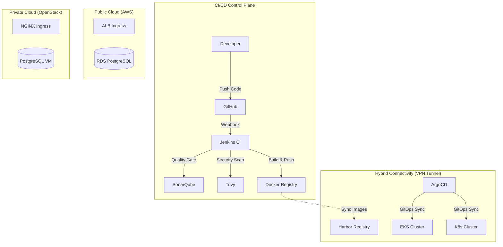

# Enterprise DevSecOps Hybrid Cloud Platform (AWS + OpenStack)

[](./CICD/)
[](./terraform/)
[](./k8s/)
[](LICENSE)

> **A comprehensive, production-grade DevSecOps implementation demonstrating the convergence of Public Cloud (AWS) scalability and Private Cloud (OpenStack) data sovereignty.**

---

## 📑 Table of Contents

- [Executive Summary](#-executive-summary)
- [System Architecture](#-system-architecture)
- [Key Technologies](#-key-technologies)
- [Core Features](#-core-features)
- [Deployment Components](#-deployment-components)
- [Prerequisites](#-prerequisites)
- [Quick Start Guide](#-quick-start-guide)
- [Documentation Map](#-documentation-map)
- [Demo Scenarios](#-demo-scenarios)

---

## 📋 Executive Summary

This project establishes a robust **DevSecOps CI/CD Pipeline** designed for hybrid cloud environments. It addresses modern enterprise challenges: ensuring data privacy for sensitive workloads (via OpenStack) while leveraging the elastic scalability of public clouds (via AWS) for customer-facing services.

The solution employs a **"Shift-Left Security"** approach, integrating automated security scanning (SAST/DAST) directly into the CI/CD workflow, ensuring that every deployment is vetted for vulnerabilities before reaching production.

---

## 🏗 System Architecture

The architecture implements a **Hub-and-Spoke** model with a centralized CI/CD control plane managing deployments across disparate cloud environments connected via a Site-to-Site VPN.

### 1. High-Level Diagram



### 2. Operational Flow
1. **Continuous Integration**: Code commit triggers Jenkins pipeline -> Unit Tests -> SonarQube Analysis -> Trivy Security Scan -> Docker Build.
2. **Artifact Management**: Docker images are pushed to GitHub Container Registry (Primary) and replicated to AWS ECR and internal Harbor registry.
3. **Continuous Deployment**: ArgoCD detects manifest changes and synchronizes state to both EKS (AWS) and K8s (OpenStack) clusters.
4. **Hybrid Networking**: Secure VPN facilitates encrypted communication between microservices across clouds.

---

## 🛠 Key Technologies

| Category | Technology Stack |
|----------|------------------|
| **Clouds** | AWS (Public), OpenStack (Private) |
| **Orchestration** | Kubernetes (EKS / Kubeadm) |
| **CI/CD** | Jenkins, ArgoCD, GitHub Actions |
| **Security** | Trivy (Container Security), SonarQube (Code Quality) |
| **Infrastructure** | Terraform (IaC), Bash Scripts (Manual Ops) |
| **Observability** | Prometheus (Metrics), Grafana (Visualization) |
| **Registry** | AWS ECR, Harbor, GitHub Container Registry |
| **Services** | Java Spring Boot (Backend), Next.js (Frontend), PostgreSQL |

---

## ✨ Core Features

### 🔐 Security & Compliance
- **Automated Vulnerability Scanning**: Blocks pipelines if CVEs > Critical severity are found.
- **Secrets Management**: K8s Secrets encrypted at rest.
- **Network Policies**: Zero-trust architecture between microservices.

### 🔄 Hybrid Cloud Operations
- **Unified Management**: Single pane of glass for multi-cloud monitoring via Grafana Federation.
- **Image Replication**: Automatic sync between Public ECR and Private Harbor registries.
- **High Availability**: Failover capabilities between cloud providers.

### ⚡ Developer Experience
- **GitOps Workflow**: "Everything as Code" - all infra and app changes are version controlled.
- **Rapid Feedback**: Immediate feedback loops via Jenkins and SonarQube dashboards.

---

## 📦 Deployment Components

The project offers two distinct deployment methodologies catering to different operational needs:

### Method A: Infrastructure as Code (Recommended)
Using **Terraform** for reproducible, state-managed infrastructure provisioning.
- **Path**: [`/terraform`](./terraform/)
- **Best for**: Production environments, team collaboration.

### Method B: Manual Ops Scripts (Educational)
Using **Shell Scripts** & **CLI** tools for deep understanding of underlying resources.
- **Path**: [`/manual-deployment`](./manual-deployment/)
- **Guide**: [**NO-TERRAFORM-GUIDE.md**](./docs/NO-TERRAFORM-GUIDE.md)
- **Best for**: Learning, debugging, environments where Terraform is restricted.

---

## 🚦 Prerequisites

Before starting, ensure your environment meets the following requirements:

- **Workstation**: Linux/MacOS (recommended) or Windows WSL2.
- **Tools**: Docker, kubectl, aws-cli, openstack-cli, jq.
- **Resources**:
  - AWS Account with Admin privileges.
  - Access to an OpenStack tenant (optional for hybrid features).

---

## ⚡ Quick Start Guide

You can spin up the local CI/CD observability stack in minutes:

```bash
# 1. Clone the repository
git clone https://github.com/vutd22uit/DEVSECOPS-HYBRID-CLOUD.git
cd DEVSECOPS-HYBRID-CLOUD

# 2. Run the initialization script
chmod +x quick-start.sh
./quick-start.sh
```

**Access Points:**
- **Jenkins**: `http://localhost:8080` (Default: `admin`/`admin123`)
- **SonarQube**: `http://localhost:9000` (Default: `admin`/`admin`)
- **Frontend App**: `http://localhost:3000`

---

## 📚 Documentation Map

Detailed guidebooks for every aspect of the system:

| Document | Description |Target Audience |
|----------|-------------|----------------|
| [**NO-TERRAFORM-GUIDE**](./docs/NO-TERRAFORM-GUIDE.md) | **★ Highlight**: How to deploy *without* Terraform. | Ops / Students |
| [**DEPLOYMENT-GUIDE**](./docs/DEPLOYMENT-GUIDE.md) | Standard deployment procedures. | DevOps Engineers |
| [**DEMO-SCENARIO**](./docs/DEMO-SCENARIO.md) | Step-by-step script for project presentation. | Presenters |
| [**TROUBLESHOOTING**](./docs/TROUBLESHOOTING.md) | Solutions for common deployment errors. | Administrators |

---

## 🎬 Demo Scenarios

We have prepared specific scenarios to demonstrate system capabilities:

1. **"The Shift-Left"**: Commit "bad code" and watch the pipeline block deployment due to security/quality failure.
2. **"The Hybrid Sync"**: Deploy a new version and watch ArgoCD update pods on AWS and OpenStack simultaneously.
3. **"The Chaos"**: Terminate a Private Cloud node and verify service continuity.

---

<div align="center">

**Project maintained by [Vu Truong Doan]**

*Open Source for the Community. Contributions are Welcome!*

</div>
