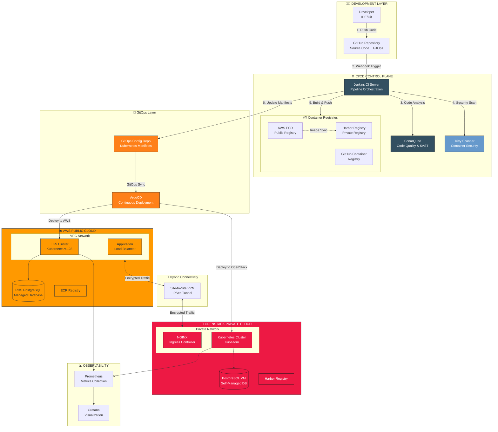
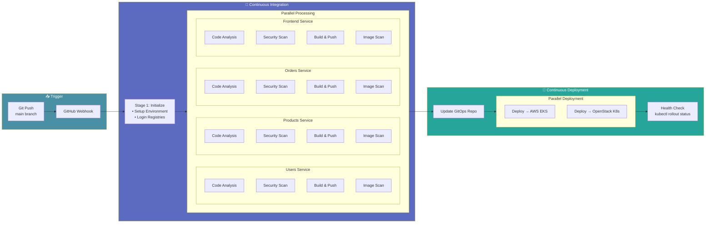
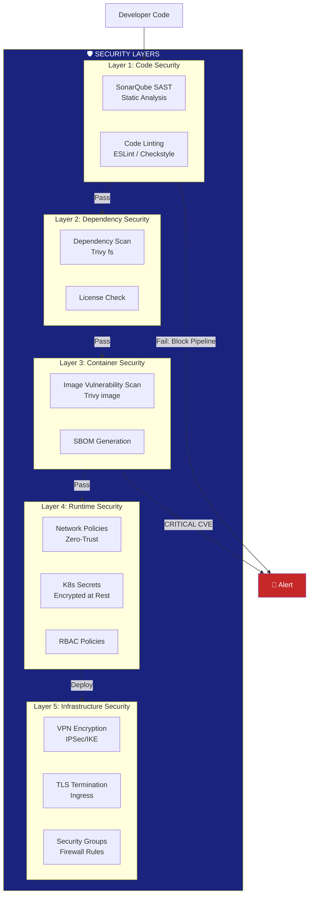
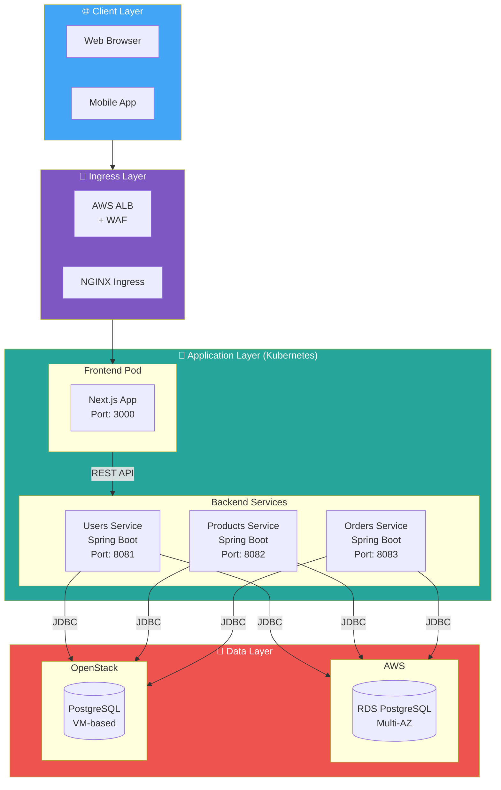
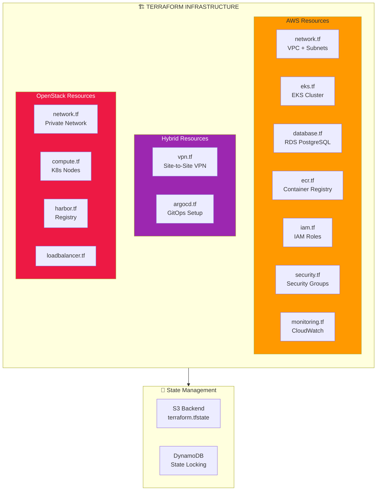
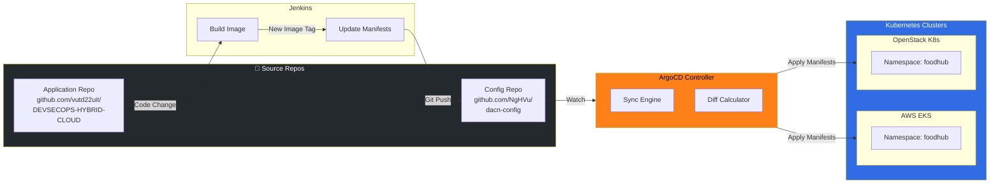
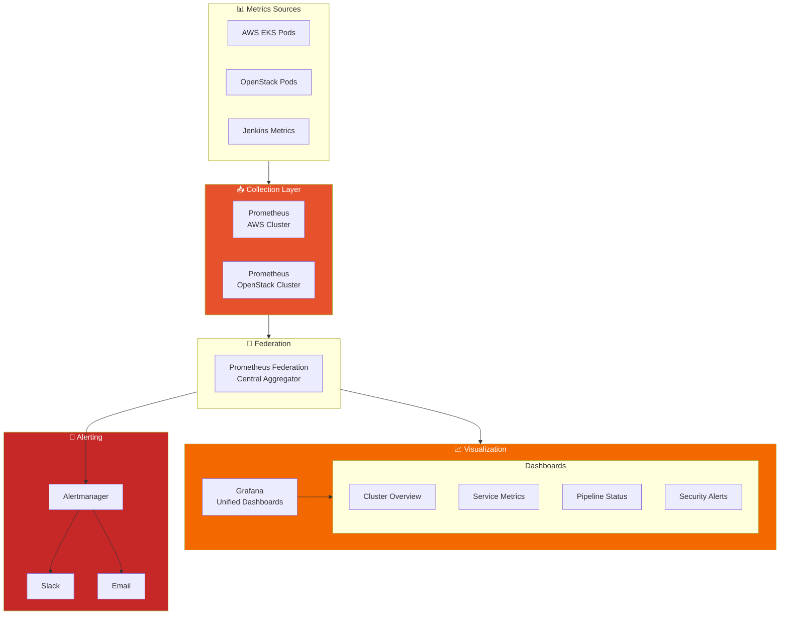
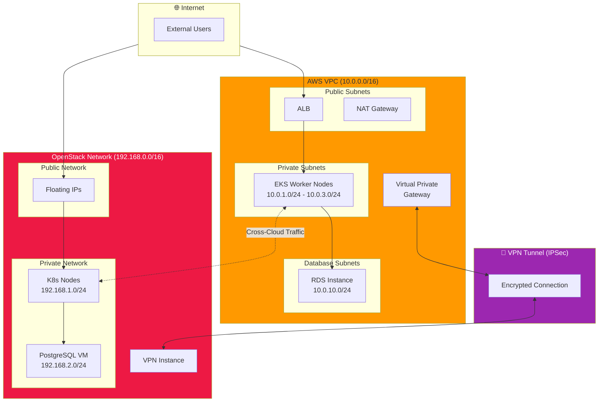
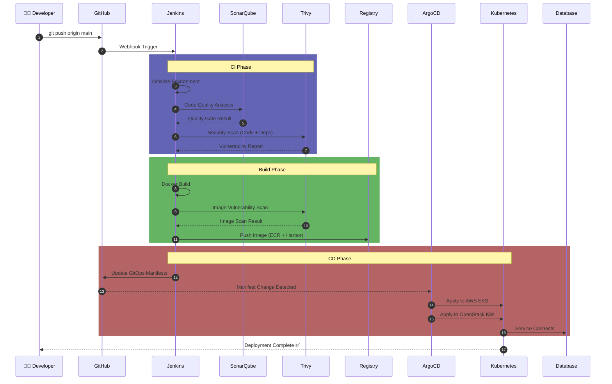
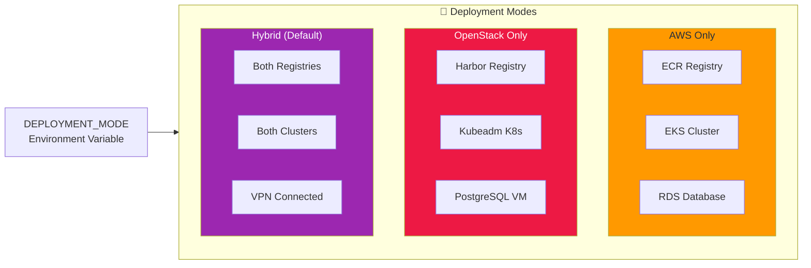

# 🏗️ Enterprise DevSecOps Hybrid Cloud Architecture

## Tổng Quan Hệ Thống

Hệ thống này triển khai kiến trúc **DevSecOps Hybrid Cloud** kết hợp giữa **AWS (Public Cloud)** và **OpenStack (Private Cloud)**, sử dụng mô hình **Hub-and-Spoke** với control plane CI/CD tập trung.

---

## 1. High-Level Architecture Overview

---

## 2. CI/CD Pipeline Flow (Chi Tiết)

---

## 3. Security Architecture (Shift-Left Security)

---

## 4. Microservices Architecture

---

## 5. Infrastructure as Code (Terraform)

---

## 6. GitOps Deployment Model

---

## 7. Observability Stack

---

## 8. Network Architecture

---

## 9. Data Flow Diagram

---

## 10. Technology Stack Summary

| Layer | AWS | OpenStack | Shared |
|-------|-----|-----------|--------|
| **Compute** | EKS (Managed K8s) | Kubeadm K8s | - |
| **Network** | VPC + ALB | Neutron + NGINX | Site-to-Site VPN |
| **Storage** | EBS + S3 | Cinder | - |
| **Database** | RDS PostgreSQL | PostgreSQL VM | - |
| **Registry** | ECR | Harbor | GHCR |
| **CI/CD** | - | - | Jenkins |
| **GitOps** | - | - | ArgoCD |
| **Security** | - | - | Trivy, SonarQube |
| **Monitoring** | CloudWatch | - | Prometheus + Grafana |
| **IaC** | Terraform AWS | Terraform OpenStack | - |

---

## 11. Deployment Modes

---

## Kết Luận

Kiến trúc này đáp ứng các yêu cầu enterprise:

1. **High Availability**: Multi-cloud deployment với failover
2. **Security**: Shift-Left với multiple security layers
3. **Scalability**: Kubernetes auto-scaling trên cả 2 clouds
4. **Compliance**: Private cloud cho data sovereignty
5. **Automation**: GitOps với ArgoCD, IaC với Terraform
6. **Observability**: Unified monitoring với Prometheus Federation

---

*Diagram được tạo cho dự án [DEVSECOPS-HYBRID-CLOUD](file:///Users/vutruongdoan/1/DEVSECOPS-HYBRID-CLOUD)*
